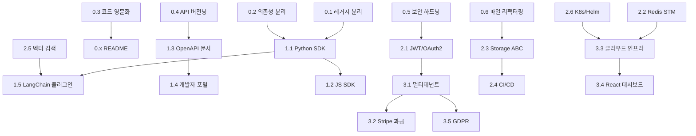

# Mories 프로덕트 전환 상세 실행 계획
> **Date**: 2026-04-06 | **Status**: Draft v1.0  
> **기반 문서**: Project Review 2026Q2 (00~05)  
> **전략**: Memory-First SDK → Cloud SaaS 순차적 전환

---

## 목차

1. [전환 전략 개요](#1-전환-전략-개요)
2. [Phase 0: Clean Foundation](#2-phase-0-clean-foundation-0-4주)
3. [Phase 1: SDK & 개발자 경험](#3-phase-1-sdk--개발자-경험-5-12주)
4. [Phase 2: 프로덕션 인프라](#4-phase-2-프로덕션-인프라-13-24주)
5. [Phase 3: Cloud SaaS](#5-phase-3-cloud-saas-25-48주)
6. [Phase 간 의존성 맵](#6-phase-간-의존성-맵)
7. [리스크 관리 계획](#7-리스크-관리-계획)
8. [KPI 및 성과 지표](#8-kpi-및-성과-지표)

---

## 1. 전환 전략 개요

### 1.1 현재 상태 → 목표 상태

```
┌─ 현재 (2026-04) ──────────────────┐     ┌─ 목표 (2027-04) ──────────────────┐
│                                     │     │                                     │
│  R&D 프로토타입                     │     │  글로벌 OSS + SaaS 프로덕트        │
│  • 1인 개발, 내부 사용              │ ──→ │  • PyPI/npm SDK, 개발자 포털        │
│  • 한국어/중문 혼재                 │     │  • OAuth2/JWT, 멀티테넌트          │
│  • Docker Compose, 수동 배포        │     │  • K8s Helm, CI/CD, 모니터링       │
│  • API Key 인증만                   │     │  • Cloud SaaS + 과금 시스템        │
│  • 레거시 코드 24% 혼재             │     │  • 경량화된 코어, 플러그인 구조     │
│                                     │     │                                     │
└─────────────────────────────────────┘     └─────────────────────────────────────┘
```

### 1.2 4 Phase 요약

| Phase | 이름 | 기간 | 핵심 결과물 | 첫 번째 검증 마일스톤 |
|-------|------|------|------------|---------------------|
| **0** | Clean Foundation | 0-4주 | 레거시 분리, 코드 영문화, 보안 기초 | `pip install mories-core` 가능 |
| **1** | SDK & DX | 5-12주 | Python/JS SDK, 개발자 포털, LangChain 플러그인 | GitHub 100 Stars |
| **2** | Production Ready | 13-24주 | OAuth2, Redis STM, K8s, CI/CD, 벡터 검색 | 자체 SaaS 인프라 가동 |
| **3** | Cloud SaaS | 25-48주 | 멀티테넌트, Stripe 과금, GDPR | 첫 유료 고객 |

### 1.3 투자 규모 예측

| 자원 | Phase 0 | Phase 1 | Phase 2 | Phase 3 |
|------|---------|---------|---------|---------|
| **개발 시간** | 4주 | 8주 | 12주 | 24주 |
| **인프라 비용** | $0 | $50/월 | $200/월 | $500+/월 |
| **외부 서비스** | - | 도메인($12) | Auth0($23), Qdrant Cloud | Stripe, CDN |
| **법무** | - | - | - | GDPR 컨설팅 |

---

## 2. Phase 0: Clean Foundation (0-4주)

> **목표**: 프로덕트 전환의 기술적 장벽을 제거하여, SDK 추출이 가능한 "깨끗한 코어"를 확보한다.

### Task 0.1: 레거시 코드 분리

**현재 문제**: 전체 코어 39,973 LOC 중 ~9,734 LOC (24%)가 시뮬레이션/보고서 레거시 코드  
**목표**: 인지 메모리 코어에서 비핵심 기능을 물리적으로 분리

| # | 세부 작업 | 파일/모듈 | 공수 | 완료 기준 |
|---|----------|----------|------|----------|
| 0.1.1 | `src/app/plugins/simulation/` 디렉토리 생성 및 시뮬레이션 코드 이동 | `simulation_runner.py` (1,788 LOC), `simulation_manager.py` (531 LOC), `simulation_config_generator.py` (987 LOC), `oasis_profile_generator.py` (1,140 LOC) | 2일 | 이동 후 기존 import 경로에 deprecation warning 추가 |
| 0.1.2 | `api/simulation.py` (2,715 LOC) → `plugins/simulation/api.py`로 이동 | 블루프린트 등록을 조건부로 변경: `if ENABLE_SIMULATION_PLUGIN` | 1일 | 시뮬레이션 기능 없이도 서버 기동 가능 |
| 0.1.3 | `report_agent.py` (2,579 LOC) → `plugins/reports/` 분리 | 코어 메모리 엔진에서 참조 제거 | 1일 | |
| 0.1.4 | 분리 후 통합 테스트 실행, 메모리 코어 기능 검증 | `pytest tests/ -k "not simulation"` | 0.5일 | 기존 120 Pass 유지 |

**산출물**:
```
src/app/
├── plugins/
│   ├── simulation/     ← 이동된 시뮬레이션 코드
│   │   ├── __init__.py
│   │   ├── api.py      ← 기존 api/simulation.py
│   │   ├── runner.py
│   │   ├── manager.py
│   │   ├── config_generator.py
│   │   └── oasis_profile.py
│   └── reports/        ← 이동된 보고서 코드
│       ├── __init__.py
│       └── report_agent.py
├── storage/            ← 순수 인지 메모리 코어 (변경 없음)
├── services/           ← graph_tools 등 핵심 서비스만 잔류
└── api/                ← 시뮬레이션 API 제거 후 경량화
```

**효과**: 코어 LOC 39,973 → **~30,239** (24% 감소)

---

### Task 0.2: 의존성 재구조화 (pyproject.toml)

**현재 문제**: `pyproject.toml`에 `camel-oasis`, `camel-ai`, `PyMuPDF`가 필수 의존성으로 포함 → 설치 시간 10분+, 디스크 3GB+, 중국어 주석

| # | 세부 작업 | 공수 | 완료 기준 |
|---|----------|------|----------|
| 0.2.1 | `pyproject.toml` 패키지명 변경: `mirofish-offline-backend` → `mories` | 0.5일 | |
| 0.2.2 | 의존성 3단계 분리 | 0.5일 | 아래 구조 참조 |
| 0.2.3 | `requirements.txt` 영문 주석 전환 + 파일 구조 동기화 | 0.5일 | 중국어 주석 0건 |
| 0.2.4 | 설치 스모크 테스트: `pip install -e ".[core]"` | 0.5일 | < 60초 설치 완료 |

**목표 pyproject.toml 구조**:
```toml
[project]
name = "mories"
version = "1.0.0-alpha"
description = "Cognitive Memory Engine for AI Agents"
requires-python = ">=3.11"
license = { text = "AGPL-3.0" }

dependencies = [
    # Core framework
    "flask>=3.0.0",
    "flask-cors>=6.0.0",
    "flask-limiter>=3.0.0",
    "openai>=1.0.0",
    "neo4j>=5.15.0",
    "requests>=2.28.0",
    "python-dotenv>=1.0.0",
    "pydantic>=2.0.0",
    "python-json-logger>=4.1.0",
    "prometheus-client>=0.24.1",
]

[project.optional-dependencies]
simulation = ["camel-oasis==0.2.5", "camel-ai==0.2.78"]
adapters = ["PyMuPDF>=1.24.0", "charset-normalizer>=3.0.0", "chardet>=5.0.0"]
distributed = ["ray>=2.9.0"]
dev = ["pytest>=8.0.0", "pytest-asyncio>=0.23.0", "pytest-cov>=4.0.0"]
all = ["mories[simulation,adapters,distributed,dev]"]
```

---

### Task 0.3: 코드 영문화 (i18n 기반 작업)

**현재 문제**: 중국어 주석 (~80건), 한국어 docstring/변수명 (~30건), 영어 혼재

| # | 세부 작업 | 범위 | 공수 | 완료 기준 |
|---|----------|------|------|----------|
| 0.3.1 | `pyproject.toml` + `requirements.txt` 중문 주석 → 영문 | 2개 파일 | 0.5일 | 중문 0건 |
| 0.3.2 | `src/app/` 내 모든 `.py` 파일의 중문/한국어 주석 → 영문 | ~100 파일 스캔 | 2일 | grep 결과 0건 |
| 0.3.3 | `dashboard/*.html` 내 UI 문자열의 한국어 텍스트 영문 기본값 적용 | 15개 HTML | 1일 | |
| 0.3.4 | `README.md` 영문 버전 작성 (글로벌 OSS 공개용) | 1개 파일 | 1일 | badges, quickstart, architecture diagram 포함 |
| 0.3.5 | `CONTRIBUTING.md`, `CODE_OF_CONDUCT.md` 작성 | 신규 | 0.5일 | |

---

### Task 0.4: API 버전닝 도입

**현재 문제**: 모든 API가 `/api/memory/...`, `/api/graph/...`로 버전 없이 노출

| # | 세부 작업 | 공수 | 완료 기준 |
|---|----------|------|----------|
| 0.4.1 | URL prefix를 `/api/` → `/api/v1/`로 일괄 변경 | 1일 | 모든 블루프린트에 `url_prefix='/api/v1/...'` |
| 0.4.2 | `/api/` 레거시 경로에 301 Redirect + deprecation header 추가 | 0.5일 | `X-API-Deprecated: true` |
| 0.4.3 | MCP 서버 엔드포인트 경로 동기화 | 0.5일 | `mories_mcp.py`의 `_dispatch` 매핑 업데이트 |
| 0.4.4 | 대시보드 JavaScript fetch URL 업데이트 | 0.5일 | 15개 HTML 내 API 호출 경로 수정 |

---

### Task 0.5: 보안 기초 하드닝

**현재 문제**: `exec()` 1건, 하드코딩 IP 3건, CORS `*` 허용

| # | 세부 작업 | 파일 | 공수 | 완료 기준 |
|---|----------|------|------|----------|
| 0.5.1 | `ray_executor.py:109` — `exec()` → Restricted Exec 또는 Wasm 전환 | `ray_executor.py` | 1일 | `exec()` 0건 |
| 0.5.2 | 하드코딩 IP/URL → 환경변수 전환 | MCP 서버, config | 0.5일 | `grep -rn "192.168"` 결과 0건 |
| 0.5.3 | CORS 설정을 환경별로 분리 | `__init__.py` config | 0.5일 | `PROD` 환경에서 origin 화이트리스트 적용 |
| 0.5.4 | API 응답 표준화: 통일된 에러 형식 도입 | 신규 `utils/api_response.py` | 1일 | 모든 에러가 표준 JSON 형식 |

---

### Task 0.6: 거대 파일 리팩터링

**현재 문제**: `memory_categories.py` (2,410 LOC)에 10+ 카테고리가 단일 파일 집중

| # | 세부 작업 | 공수 | 완료 기준 |
|---|----------|------|----------|
| 0.6.1 | `storage/categories/` 서브패키지 생성 | 0.5일 | `__init__.py`에서 기존 클래스 re-export (하위호환) |
| 0.6.2 | 각 카테고리를 개별 파일로 분리: `procedural.py`, `observational.py`, `instructional.py` 등 | 1일 | 각 파일 300 LOC 이하 |
| 0.6.3 | `graph_tools.py` (1,496 LOC) → `services/graph/` 서브패키지 분리 | 1일 | 기능별 분리 (분석, 쿼리, 시각화) |
| 0.6.4 | 분리 후 기존 테스트 전량 통과 확인 | 0.5일 | |

---

### Phase 0 완료 체크리스트

- [ ] `pip install -e "."` → 60초 이내, camel-oasis 없이 기동
- [ ] 중문/한국어 주석 → 0건
- [ ] `pytest tests/ -k "not simulation and not e2e_neo4j"` → 전량 PASS
- [ ] 모든 API → `/api/v1/` prefix
- [ ] `exec()` 0건, 하드코딩 IP 0건
- [ ] 코어 LOC ≤ 31,000
- [ ] `README.md` 영문판 완성

---

## 3. Phase 1: SDK & 개발자 경험 (5-12주)

> **목표**: "5분 안에 Mories를 설치하고, 첫 번째 기억을 저장하고, 불러올 수 있다"

### Task 1.1: Python SDK 패키지 추출 (`mories-sdk`)

**목적**: 서버 없이도 사용 가능한 가벼운 클라이언트 라이브러리

| # | 세부 작업 | 공수 | 완료 기준 |
|---|----------|------|----------|
| 1.1.1 | `sdk/python/` 디렉토리 생성, `pyproject.toml` 설정 | 0.5일 | `mories-sdk` 패키지 메타데이터 |
| 1.1.2 | 핵심 클라이언트 클래스 구현: `MoriesClient` | 3일 | REST API 전 엔드포인트 래핑 |
| 1.1.3 | 인지 메모리 API 래핑: `remember()`, `recall()`, `forget()`, `imprint()` | 2일 | Pythonic 인터페이스 |
| 1.1.4 | 하네스 API 래핑: `harness.record()`, `harness.execute()`, `harness.evolve()` | 1일 | |
| 1.1.5 | 비동기 지원: `AsyncMoriesClient` | 2일 | `aiohttp` 기반 |
| 1.1.6 | 에러 핸들링: 커스텀 예외 계층 | 1일 | `MoriesError`, `MemoryNotFoundError`, `AuthenticationError` |
| 1.1.7 | 타입 힌트 + dataclass 모델 | 1일 | `Memory`, `HarnessPattern`, `SearchResult` |
| 1.1.8 | PyPI 배포 자동화 (GitHub Actions) | 1일 | `pip install mories-sdk` 가능 |
| 1.1.9 | SDK README + Quickstart 예제 5종 | 1일 | |

**목표 API 디자인**:
```python
from mories import MoriesClient

client = MoriesClient(url="http://localhost:8765", api_key="sk-xxx")

# 기억 저장
memory = client.remember(
    content="Flask는 Blueprint 패턴으로 모듈화해야 한다",
    salience=0.9,
    scope="tribal",
    tags=["flask", "architecture"]
)

# 기억 검색
results = client.recall("Flask architecture patterns", limit=5)

# 영구 기억 각인
client.imprint(
    content="보안 리뷰 없이 코드를 배포하지 않는다",
    category="policy",
    priority=10
)

# 감쇠 상태 확인
health = client.health()
print(health.total_memories, health.stm_count, health.ltm_count)
```

---

### Task 1.2: JavaScript/TypeScript SDK

| # | 세부 작업 | 공수 | 완료 기준 |
|---|----------|------|----------|
| 1.2.1 | `sdk/js/` 디렉토리, `package.json`, TypeScript 설정 | 0.5일 | |
| 1.2.2 | `MoriesClient` 클래스 (fetch 기반) | 3일 | `npm install @mories/sdk` |
| 1.2.3 | TypeScript 타입 정의 | 1일 | 전체 API 인터페이스 |
| 1.2.4 | Node.js + Browser 번들 (esm/cjs) | 1일 | |
| 1.2.5 | npm 배포 자동화 | 0.5일 | |

---

### Task 1.3: OpenAPI/Swagger 자동 문서화

**현재 문제**: API 문서가 수동 작성된 HTML/Markdown. 166 엔드포인트의 스키마 미정의

| # | 세부 작업 | 공수 | 완료 기준 |
|---|----------|------|----------|
| 1.3.1 | `flask-smorest` 또는 `flasgger` 의존성 추가 | 0.5일 | 라이브러리 선택 및 설치 |
| 1.3.2 | 메모리 CRUD API (memory.py) 스키마 정의 | 2일 | Pydantic 또는 Marshmallow 모델 |
| 1.3.3 | 하네스 API (harness_analytics.py) 스키마 정의 | 1일 | |
| 1.3.4 | 관리/인프라 API 스키마 정의 | 1일 | admin, core, ingest |
| 1.3.5 | Swagger UI `/api/docs` 엔드포인트 활성화 | 0.5일 | 자동 탐색 가능 |
| 1.3.6 | OpenAPI JSON → SDK 클라이언트 자동 생성 파이프라인 | 1일 | `openapi-generator-cli` |

---

### Task 1.4: 개발자 포털 (`docs.mories.dev`)

| # | 세부 작업 | 공수 | 완료 기준 |
|---|----------|------|----------|
| 1.4.1 | Docusaurus/MkDocs 프로젝트 초기화 | 0.5일 | |
| 1.4.2 | **Getting Started** 가이드: 설치 → 첫 기억 → 검색 (5분 완료) | 1일 | |
| 1.4.3 | **Core Concepts**: STM/LTM/PM, Scope, Categories, Decay 설명 | 2일 | 다이어그램 포함 |
| 1.4.4 | **API Reference**: OpenAPI Spec 에서 자동 생성 | 1일 | |
| 1.4.5 | **Integrations**: LangChain, CrewAI, MCP 가이드 | 2일 | 코드 예제 포함 |
| 1.4.6 | **Self-Hosting Guide**: Docker Compose, K8s, 환경 설정 | 1일 | |
| 1.4.7 | GitHub Pages / Vercel 배포 | 0.5일 | |
| 1.4.8 | SEO 최적화 (meta tags, sitemap) | 0.5일 | |

---

### Task 1.5: LangChain/LangGraph 통합 플러그인

**목적**: AI 프레임워크 생태계 최대 채널 진입

| # | 세부 작업 | 공수 | 완료 기준 |
|---|----------|------|----------|
| 1.5.1 | `langchain-mories` 패키지 생성 | 0.5일 | |
| 1.5.2 | `MoriesMemory(BaseChatMemory)` 구현 | 2일 | LangChain Memory 인터페이스 준수 |
| 1.5.3 | `MoriesVectorStore(VectorStore)` 구현 (Phase 2 벡터 검색 선행) | 2일 | |
| 1.5.4 | LangGraph `StateGraph`에 Mories 상태 주입 예제 | 1일 | |
| 1.5.5 | CrewAI `Memory` 통합 어댑터 | 1일 | |
| 1.5.6 | PyPI 배포 + 통합 문서 | 0.5일 | |

**목표 사용 예**:
```python
from langchain_mories import MoriesMemory
from langchain_openai import ChatOpenAI

memory = MoriesMemory(
    url="http://localhost:8765",
    api_key="sk-xxx",
    scope="tribal"
)

chain = ConversationChain(
    llm=ChatOpenAI(),
    memory=memory  # Mories가 LangChain의 메모리 백엔드로 작동
)
```

---

### Phase 1 완료 체크리스트

- [ ] `pip install mories-sdk` → PyPI에서 설치 가능
- [ ] `npm install @mories/sdk` → npm에서 설치 가능
- [ ] `/api/docs` → Swagger UI 접근 가능
- [ ] `docs.mories.dev` → 라이브 문서 포털
- [ ] LangChain Memory 플러그인 → PyPI 배포
- [ ] GitHub Stars ≥ 50

---

## 4. Phase 2: 프로덕션 인프라 (13-24주)

> **목표**: 외부 사용자가 안심하고 사용할 수 있는 엔터프라이즈급 신뢰성 확보

### Task 2.1: 인증/인가 계층 재설계

**현재 문제**: API Key 헤더 수준. JWT/OAuth/멀티테넌트 없음

| # | 세부 작업 | 공수 | 완료 기준 |
|---|----------|------|----------|
| 2.1.1 | Auth 모듈 설계: `src/app/auth/` 패키지 신규 생성 | 1일 | |
| 2.1.2 | JWT 토큰 발급/검증 미들웨어 | 3일 | Access Token (15분) + Refresh Token (7일) |
| 2.1.3 | OAuth2 Provider 통합 (Google, GitHub) | 3일 | Social Login |
| 2.1.4 | API Key → JWT 마이그레이션 가이드 | 1일 | 기존 API Key도 병행 지원 |
| 2.1.5 | `@require_auth` 데코레이터로 전 엔드포인트 보호 | 2일 | |
| 2.1.6 | 기존 RBAC 시스템과 JWT 클레임 통합 | 2일 | role-based endpoint access |
| 2.1.7 | 사용량 제한 (Rate Limit)의 사용자별 적용 | 1일 | Free: 100req/min, Pro: 1000req/min |

---

### Task 2.2: STM 영속화 (Redis 전환)

**현재 문제**: STM 버퍼가 in-memory Dict → 서버 재시작 시 100% 유실

| # | 세부 작업 | 공수 | 완료 기준 |
|---|----------|------|----------|
| 2.2.1 | `storage/stm_backend.py` ABC 정의: `AbstractSTMBackend` | 1일 | `add()`, `get()`, `list()`, `pop()`, `clear()` |
| 2.2.2 | `InMemorySTMBackend` (기존 Dict 래핑) | 0.5일 | 하위호환 기본값 |
| 2.2.3 | `RedisSTMBackend` 구현 (Redis Sorted Set + TTL) | 3일 | TTL = 24h 기본 |
| 2.2.4 | `MemoryManager` → STM Backend DI 전환 | 1일 | config로 `STM_BACKEND=redis` 전환 가능 |
| 2.2.5 | Docker Compose에 Redis 서비스 추가 | 0.5일 | |
| 2.2.6 | Redis STM 통합 테스트 | 1일 | 서버 재시작 후 STM 유지 검증 |

---

### Task 2.3: Storage ABC 인터페이스 + Mock 기반 테스트

**현재 문제**: 모든 테스트가 Neo4j 실 인스턴스 의존 → CI/CD 불가

| # | 세부 작업 | 공수 | 완료 기준 |
|---|----------|------|----------|
| 2.3.1 | `AbstractMemoryStorage` ABC 정의 | 1일 | 모든 Storage 메서드의 인터페이스 |
| 2.3.2 | `Neo4jStorage(AbstractMemoryStorage)` 리팩터링 | 2일 | ABC 준수 |
| 2.3.3 | `InMemoryStorage(AbstractMemoryStorage)` 구현 (테스트용) | 2일 | Dict 기반 완전 기능 구현 |
| 2.3.4 | 기존 테스트의 Neo4j Fixture → InMemoryStorage Fixture 추가 | 3일 | 모든 단위 테스트가 Neo4j 없이 실행 |
| 2.3.5 | CI용 테스트 분리: `pytest -m "not requires_neo4j"` | 1일 | |

---

### Task 2.4: CI/CD 파이프라인

| # | 세부 작업 | 공수 | 완료 기준 |
|---|----------|------|----------|
| 2.4.1 | `.github/workflows/ci.yml` — PR 자동 테스트 | 1일 | lint + unit test + coverage |
| 2.4.2 | `.github/workflows/release.yml` — 태그 시 PyPI/npm 자동 배포 | 1일 | `v1.0.0` 태그 → 자동 배포 |
| 2.4.3 | `.github/workflows/integration.yml` — Neo4j 포함 통합 테스트 | 1일 | 야간 실행 (testcontainers) |
| 2.4.4 | 코드 커버리지 ≥ 70% 게이트 | 0.5일 | PR 병합 차단 |
| 2.4.5 | 린트/포맷팅: `ruff` + `black` + `mypy` 설정 | 0.5일 | |

---

### Task 2.5: 벡터 검색 통합

**현재 문제**: 텍스트 기반 검색만 가능. 시맨틱 검색 = 경쟁력의 핵심 기능

| # | 세부 작업 | 공수 | 완료 기준 |
|---|----------|------|----------|
| 2.5.1 | 벡터 DB 선택 및 연동: Qdrant (Cloud Free Tier) 또는 pgvector | 1일 | |
| 2.5.2 | `storage/vector_backend.py` — ABC + Qdrant 구현 | 3일 | |
| 2.5.3 | 기억 저장 시 자동 임베딩 생성 (OpenAI Ada 또는 로컬 모델) | 2일 | |
| 2.5.4 | `recall()` API에 시맨틱 검색 모드 추가 | 2일 | `?search_mode=semantic` |
| 2.5.5 | 하이브리드 검색 (키워드 + 벡터 + 그래프 융합) | 2일 | |
| 2.5.6 | 벡터 인덱스 마이그레이션 도구 (기존 기억 → 임베딩 일괄 생성) | 1일 | |

---

### Task 2.6: Kubernetes 배포 + 모니터링

| # | 세부 작업 | 공수 | 완료 기준 |
|---|----------|------|----------|
| 2.6.1 | Helm Chart 작성: `charts/mories/` | 3일 | `helm install mories ./charts/mories` |
| 2.6.2 | TLS Ingress (cert-manager + Let's Encrypt) | 1일 | HTTPS 기본 |
| 2.6.3 | HPA (Horizontal Pod Autoscaler) 설정 | 1일 | CPU 80% → Scale-out |
| 2.6.4 | Grafana 대시보드 JSON 정의 (QPS, Latency, Errors, Memory Health) | 1일 | |
| 2.6.5 | AlertManager 룰: 에러율 5% 초과, P95 지연 500ms 초과 | 0.5일 | |
| 2.6.6 | OpenTelemetry SDK 통합 (분산 트레이싱) | 2일 | 요청 추적 ID 연쇄 |

---

### Task 2.7: 부하 테스트 + 벤치마크

| # | 세부 작업 | 공수 | 완료 기준 |
|---|----------|------|----------|
| 2.7.1 | Locust/k6 부하 테스트 시나리오 작성 | 2일 | 메모리 CRUD, 검색, 하네스 실행 |
| 2.7.2 | 단일 인스턴스 벤치마크 실행 | 1일 | 결과 기록 |
| 2.7.3 | 3-replica 수평 확장 벤치마크 | 1일 | 선형 확장 검증 |
| 2.7.4 | 벤치마크 결과를 공개 문서로 게시 | 0.5일 | `docs.mories.dev/benchmarks` |

---

### Phase 2 완료 체크리스트

- [ ] OAuth2/JWT 인증 → 모든 API에 적용
- [ ] STM Redis 영속화 → 서버 재시작 후 STM 유지
- [ ] `pytest -m "not requires_neo4j"` → CI에서 100% 실행 가능
- [ ] GitHub Actions CI/CD → PR 자동 테스트 + 태그 배포
- [ ] 시맨틱 검색 → `?search_mode=semantic` 작동
- [ ] Helm Chart → 1-command K8s 배포
- [ ] 벤치마크: P95 < 200ms @ 100 concurrent users

---

## 5. Phase 3: Cloud SaaS (25-48주)

> **목표**: 유료 고객을 받을 수 있는 멀티테넌트 클라우드 서비스

### Task 3.1: 멀티테넌트 아키텍처

| # | 세부 작업 | 공수 | 완료 기준 |
|---|----------|------|----------|
| 3.1.1 | 테넌트 모델 설계: `Tenant`, `User`, `ApiKey` 엔티티 | 2일 | |
| 3.1.2 | Neo4j 그래프에 테넌트 ID 라벨/속성 추가 | 3일 | `:Memory {tenant_id: "xxx"}` |
| 3.1.3 | 모든 Storage/Service 레이어에 테넌트 컨텍스트 주입 | 5일 | `g.tenant_id` → 자동 필터 |
| 3.1.4 | 테넌트 격리 검증 (A 테넌트가 B 데이터 접근 불가) | 2일 | 보안 테스트 |
| 3.1.5 | 테넌트별 사용량 집계 + 쿼터 시스템 | 2일 | 메모리 수, API 호출 수 |

---

### Task 3.2: 과금 시스템 (Stripe)

| # | 세부 작업 | 공수 | 완료 기준 |
|---|----------|------|----------|
| 3.2.1 | Stripe Products/Prices 설정 (Free/Pro/Enterprise) | 1일 | |
| 3.2.2 | Stripe Checkout Session 통합 | 2일 | 결제 페이지 |
| 3.2.3 | Webhook 수신: `invoice.paid`, `customer.subscription.deleted` | 2일 | |
| 3.2.4 | 사용량 기반 과금 (초과 시 throttling) | 2일 | Free: 5K, Pro: 100K |
| 3.2.5 | 과금 대시보드 UI | 2일 | |

---

### Task 3.3: 클라우드 인프라 프로비저닝

| # | 세부 작업 | 공수 | 완료 기준 |
|---|----------|------|----------|
| 3.3.1 | Terraform/Pulumi IaC: AWS EKS 또는 GKE 클러스터 | 5일 | |
| 3.3.2 | Neo4j Aura (Managed) 또는 자체 Causal Clustering | 3일 | |
| 3.3.3 | Redis Cluster (ElastiCache) | 1일 | |
| 3.3.4 | 일일 자동 백업 (Neo4j + Redis + Vector DB) | 2일 | |
| 3.3.5 | 글로벌 CDN (CloudFlare/Fastly) | 1일 | |
| 3.3.6 | 멀티리전 배포 (us-east-1, eu-west-1) | 5일 | |

---

### Task 3.4: 대시보드 재구축 (React SPA)

| # | 세부 작업 | 공수 | 완료 기준 |
|---|----------|------|----------|
| 3.4.1 | Next.js 프로젝트 초기화 | 1일 | |
| 3.4.2 | 디자인 시스템 (Tailwind + Radix UI) | 3일 | 컴포넌트 라이브러리 |
| 3.4.3 | 메모리 탐색기 UI (검색, 필터, 카드 뷰) | 5일 | |
| 3.4.4 | 지식 그래프 시각화 (D3/Cytoscape) | 5일 | |
| 3.4.5 | 하네스 실행 모니터링 대시보드 | 3일 | |
| 3.4.6 | 계정 설정, API 키 관리, 과금 UI | 3일 | |
| 3.4.7 | 반응형 + a11y (WCAG 2.1 AA) | 2일 | |

---

### Task 3.5: 규정 준수

| # | 세부 작업 | 공수 | 완료 기준 |
|---|----------|------|----------|
| 3.5.1 | 개인정보 처리방침 작성 (영문) | 2일 | |
| 3.5.2 | GDPR 데이터 삭제 API: `DELETE /api/v1/user/data` | 3일 | 72시간 내 완전 삭제 |
| 3.5.3 | 데이터 내보내기 API: `GET /api/v1/user/export` | 2일 | JSON/CSV |
| 3.5.4 | SOC2 Type 1 준비 (접근 로그, 변경 관리 문서) | 8주+ | |
| 3.5.5 | 서비스 이용약관 작성 | 1일 | |

---

### Phase 3 완료 체크리스트

- [ ] 멀티테넌트 → 테넌트 격리 검증 통과
- [ ] Stripe 과금 → 첫 유료 결제 성공
- [ ] Cloud SaaS → `app.mories.dev` 라이브
- [ ] GDPR → 데이터 삭제/내보내기 API 작동
- [ ] 대시보드 → React SPA 배포
- [ ] 첫 유료 고객 확보

---

## 6. Phase 간 의존성 맵



### 핵심 크리티컬 패스

```
레거시 분리 (0.1) → Python SDK (1.1) → LangChain 플러그인 (1.5) → PMF 검증
                                                                         │
API 버전닝 (0.4) → OpenAPI (1.3) ──────────────────────────────────── DX
                                                                         │
보안 하드닝 (0.5) → JWT/OAuth2 (2.1) → 멀티테넌트 (3.1) → Stripe (3.2) → SaaS
```

---

## 7. 리스크 관리 계획

### 7.1 Go/No-Go 게이트

각 Phase 완료 시 다음 단계 진행 여부를 결정하는 검증 게이트:

| 게이트 | 조건 | No-Go 시 행동 |
|--------|------|---------------|
| **Phase 0 → 1** | 코어 테스트 전량 PASS, LOC ≤ 31K, exec() 0건 | 레거시 분리 재시도 |
| **Phase 1 → 2** | PyPI SDK 배포 완료, GitHub Stars ≥ 30, 외부 피드백 ≥ 5건 | DX 개선에 집중 |
| **Phase 2 → 3** | CI/CD 가동, 시맨틱 검색 작동, 벤치마크 게시 | 인프라 안정화 |
| **Phase 3 진행** | PMF 검증 (사용자 인터뷰 ≥ 10, NPS ≥ 30) | 피벗 또는 기능 축소 |

### 7.2 기술 리스크 완화

| 리스크 | 확률 | 완화 전략 | Phase |
|--------|------|---------|-------|
| Neo4j 성능 한계 | 중 | 인덱스 최적화 → 샤딩 설계 → Aura 전환 | P2 |
| LLM API 비용 초과 | 중 | 임베딩 캐시 + 로컬 모델 폴백 (Ollama) | P2 |
| 멀티테넌트 전환 복잡도 | 높 | 초기(P0)부터 `tenant_id` 필드 예약 | P0→P3 |
| 벡터 DB 선택 실수 | 낮 | ABC 패턴으로 교체 가능하게 설계 | P2 |

### 7.3 실행 리스크 완화

| 리스크 | 완화 전략 |
|--------|---------|
| **1인 개발 한계** | Phase 1 이후 컨트리뷰터 모집 (Good First Issues 10개+ 준비) |
| **번아웃** | 2주 스프린트 + 1일 쿨다운, 월간 회고 |
| **커뮤니티 부재** | Twitter/LinkedIn 주간 기술 공유, Dev.to 월간 포스트 |
| **시장 변화** | 월간 경쟁사 모니터링 + 전략 조정 회의 |

---

## 8. KPI 및 성과 지표

### 8.1 Phase별 핵심 KPI

| 지표 | Phase 0 | Phase 1 | Phase 2 | Phase 3 |
|------|---------|---------|---------|---------|
| **코어 LOC** | ≤ 31,000 | 유지 | 유지 | - |
| **테스트 Pass Rate** | ≥ 95% | ≥ 95% | ≥ 98% | ≥ 99% |
| **PyPI 다운로드수** | - | ≥ 100/월 | ≥ 1,000/월 | ≥ 5,000/월 |
| **GitHub Stars** | 0 | ≥ 50 | ≥ 500 | ≥ 2,000 |
| **API P95 지연** | - | - | ≤ 200ms | ≤ 150ms |
| **외부 사용자 수** | 0 | ≥ 10 | ≥ 100 | ≥ 1,000 |
| **MRR ($)** | $0 | $0 | $0 | ≥ $5,000 |

### 8.2 성공/실패 판정 기준

| 시점 | **성공 시나리오** | **피벗 트리거** |
|------|-----------------|----------------|
| M3 (Phase 1 완료) | PyPI 100+ DL/월, 외부 피드백 양호 | PyPI 10 DL/월 미만, 관심도 제로 |
| M6 (Phase 2 중간) | LangChain 통합 PR 승인, 500+ Stars | 생태계 통합 거부, Stars 50 미만 |
| M12 (Phase 3 시작) | PMF 검증, 파일럿 고객 확보 | 유료 전환 의사 0건 |
| M18 | MRR $5K+, 성장 추세 | MRR $1K 미만, 정체 |

### 8.3 피벗 옵션 (Plan B)

Phase 1 이후 PMF 미달 시:

1. **Option A**: Mories를 순수 라이브러리로만 운영 (SaaS 포기, OSS 유지)
2. **Option B**: 특정 수직 시장 집중 (예: AI 에이전트 테스트 자동화 메모리)
3. **Option C**: 기존 플랫폼의 Memory 모듈로 통합 제안 (LangChain, CrewAI에 인수/통합)

---

## 부록 A: Sprint 0 (첫 2주) 일별 세부 일정

### Week 1: 레거시 분리 + 의존성 + 보안

| 일 | 작업 | 담당 Task | 예상 시간 |
|---|------|----------|---------|
| Day 1 | `plugins/` 디렉토리 구조 생성 | 0.1.1 | 2h |
| Day 1 | 시뮬레이션 4개 파일 이동 + import 조정 | 0.1.1 | 4h |
| Day 2 | `api/simulation.py` → `plugins/simulation/api.py` 이동 | 0.1.2 | 3h |
| Day 2 | `report_agent.py` → `plugins/reports/` 이동 | 0.1.3 | 2h |
| Day 2 | 이동 후 테스트 실행 및 오류 수정 | 0.1.4 | 3h |
| Day 3 | `pyproject.toml` 의존성 분리 (core/extras) | 0.2.1-0.2.3 | 4h |
| Day 3 | `pip install -e "."` 스모크 테스트 | 0.2.4 | 2h |
| Day 4 | `exec()` → AST 검증 또는 Wasm 전환 | 0.5.1 | 4h |
| Day 4 | 하드코딩 IP → 환경변수 | 0.5.2 | 2h |
| Day 5 | CORS 환경별 분리 + API 응답 표준화 | 0.5.3-0.5.4 | 5h |
| Day 5 | Week 1 테스트 검증 + 정리 | - | 3h |

### Week 2: 코드 영문화 + API 버전닝 + 리팩터링

| 일 | 작업 | 담당 Task | 예상 시간 |
|---|------|----------|---------|
| Day 6 | `pyproject.toml`, `requirements.txt` 중문 → 영문 | 0.3.1 | 2h |
| Day 6 | `src/app/` 전체 중문/한국어 주석 → 영문 (상위 파일부터) | 0.3.2 | 6h |
| Day 7 | 영문화 계속 (하위 모듈) + Dashboard HTML 정리 | 0.3.2-0.3.3 | 6h |
| Day 7 | README.md 영문판 작성 | 0.3.4 | 2h |
| Day 8 | API URL prefix `/api/v1/` 변경 (10개 블루프린트) | 0.4.1-0.4.2 | 5h |
| Day 8 | MCP 서버 경로 동기화 | 0.4.3 | 2h |
| Day 9 | `memory_categories.py` 서브파일 분리 | 0.6.1-0.6.2 | 6h |
| Day 9 | `graph_tools.py` 서브패키지 분리 | 0.6.3 | 2h |
| Day 10 | 전체 테스트 실행 + Phase 0 체크리스트 검증 | 0.6.4 + 체크리스트 | 4h |
| Day 10 | CONTRIBUTING.md, CODE_OF_CONDUCT.md 작성 | 0.3.5 | 2h |
| Day 10 | Phase 0 완료 보고서 + Phase 1 착수 준비 | - | 2h |

---

## 부록 B: 파일 변경 매트릭스 (Phase 0)

| 파일/디렉토리 | 작업 유형 | Task # |
|-------------|----------|--------|
| `src/app/plugins/simulation/` | 🆕 신규 | 0.1 |
| `src/app/plugins/reports/` | 🆕 신규 | 0.1 |
| `src/app/api/simulation.py` | 🔄 이동 | 0.1.2 |
| `src/app/services/report_agent.py` | 🔄 이동 | 0.1.3 |
| `src/app/services/simulation_*.py` (3개) | 🔄 이동 | 0.1.1 |
| `src/app/services/oasis_profile_generator.py` | 🔄 이동 | 0.1.1 |
| `src/pyproject.toml` | ✏️ 수정 | 0.2 |
| `src/requirements.txt` | ✏️ 수정 | 0.2 |
| `src/app/__init__.py` | ✏️ 수정 | 0.1, 0.4, 0.5 |
| `src/app/harness/executors/ray_executor.py` | ✏️ 수정 | 0.5.1 |
| `mcp_server/mories_mcp.py` | ✏️ 수정 | 0.4.3, 0.5.2 |
| `src/app/utils/api_response.py` | 🆕 신규 | 0.5.4 |
| `src/app/storage/categories/` | 🆕 신규 | 0.6 |
| `src/app/services/graph/` | 🆕 신규 | 0.6 |
| `README.md` | ✏️ 수정 | 0.3.4 |
| `CONTRIBUTING.md` | 🆕 신규 | 0.3.5 |
| `CODE_OF_CONDUCT.md` | 🆕 신규 | 0.3.5 |
| `dashboard/*.html` (15개) | ✏️ 수정 | 0.3.3, 0.4.4 |

---

*이 문서는 2026-04-06 프로젝트 리뷰를 기반으로 작성된 실행 계획입니다.*  
*각 Phase 완료 시 Go/No-Go 게이트 검증 후 다음 단계로 진행합니다.*
